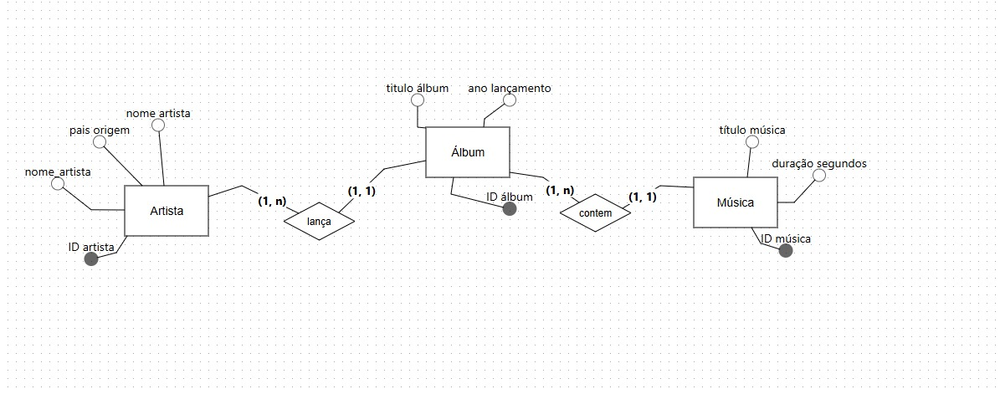
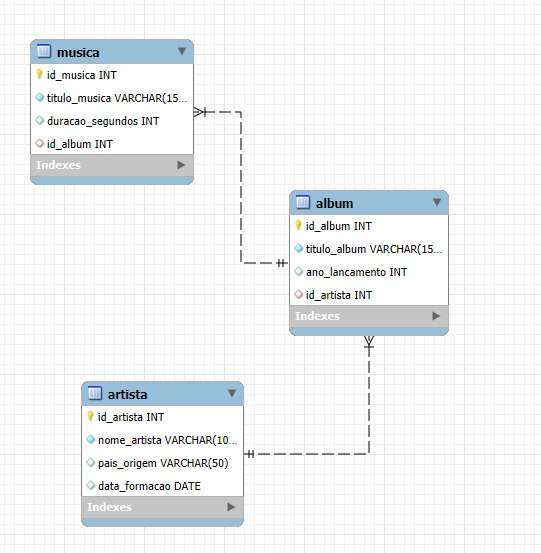
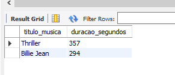
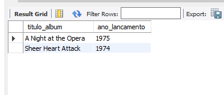
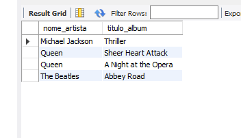
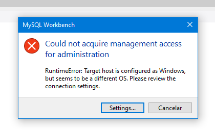
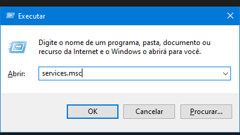
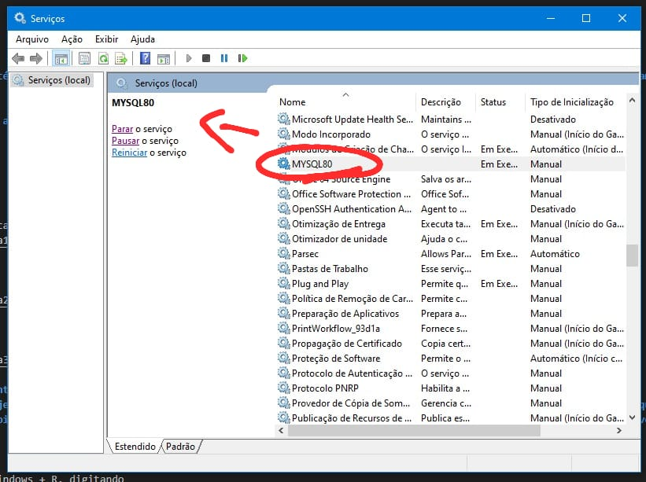

# Projeto Banco de dados - Musica
### Descrição do projeto 
#### Este projeto consiste na criação de um banco de dados relacional para gerenciar informações sobre artistas, álbuns e músicas(O tema foi selecionado em base do projeto de Front end e Mobile). O objetivo é aplicar os conceitos de modelagem de dados, normalização e manipulação de SQL, seguindo os requisitos estabelecidos para o trabalho.

### O sistema permite registrar:
- Artistas: Com seus dados básicos.
- Álbuns: associados a um artista específico 
- Músicas: associadas a um Álbum específico 

### Tecnologias Utilizadas 
- SGBD: MySQL
- Modelagem: BRModelo
- Linguagem de Consulta: SQL

### Modelagem do Banco de dados 
---
### Modelo conceitual
#### Abaixo está a imagem representando o modelo conceitual utilizado para estruturar o banco de dados do projeto. Ele descreve as entidades, atributos e relacionamentos principais.

 
### Entidades
### Foram modeladas 3 entidades principais
- Artistas 
- Álbum
- Musica 

### Relacionamentos
- Um artista lança N Albuns
- Um álbum contem  N músicas.

### Chave Estrangeira (FK)
#### Pelo menos uma tabela contém uma chave estrangeira. As tabelas Album e Musica possuem FKs, referenciando Artista e Album, respectivamente.
---
### Modelo lógico e físico 
#### O modelo lógico apresenta a estrutura com base no modelo conceitual

---

### Consultas - Exemplos.

- Duração em segundos das músicas 
---

---
- Ano de lançamento 
---

---
- Nome do artista e do Album 
---

### Problemas enfrentados durante o projeto
#### Tive que fazer todo o projeto inteiramente em casa, pois no colégio estava dando incontaveis erros e acabava não conseguindo fazer quase absolutamente nada. Um deles foi o erro 1046, que não me permitia criar tabelas etc... foi resolvido através do código "USE musica;". Tive problema com a conexão do MySQL.
---

- Consegui o resolver usando Windows + R, digitando 

- Logo procurei algo que fosse referente ao MySQL e iniciei o serviço (no caso da imagem abaixo já estava iniciado)

- Com isso consegui reestabelecer a conexão e voltei a fazer o projeto normalmente.

